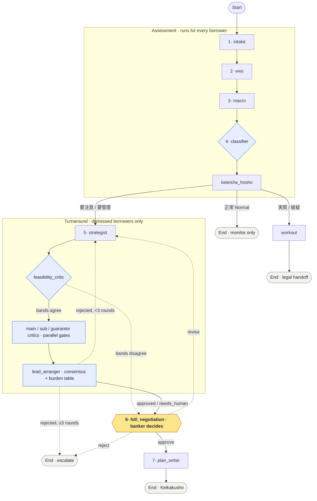

<div align="center">

# 再生 (Saisei)


[](README.md) [](docs/ja/%E8%AA%AC%E6%98%8E.md)

**Autonomous early-warning & turnaround-plan platform for Japanese regional banks.**

[](https://github.com/adilouafssou/saisei/actions/workflows/ci.yml)
[](https://www.python.org/downloads/)
[](https://github.com/astral-sh/ruff)
[](https://mypy-lang.org/)
[](https://reflex.dev/)

</div>

Saisei watches an SME borrower's financial health, classifies its credit risk under the FSA
framework, and co-authors a regulatory turnaround plan (経営改善計画書) with a banker in the loop.

Built on **LangGraph** (stateful multi-agent orchestration with native human-in-the-loop),
**Reflex** (Python-native UI), and a strict **Pydantic V2 / mypy --strict** domain core.

---

## The problem

Under the FSA **Financial Inspection Manual** (金融検査マニュアル), a regional bank must continuously
assess each borrower and, when health deteriorates, **help draft a turnaround plan** rather than
call the loan. Today that work is manual and slow:

- Relationship managers eyeball monthly trial balances (試算表) for trouble — sliding sales, margin
  compression, failed price pass-through.
- Credit classification (正常 / 要注意 / 要管理) varies by officer.
- Working-capital stress from BOJ rate normalisation and T+1/T+2 settlement is rarely modelled.
- The plan itself is written from a blank page.

The cost: **early-warning signals are caught late, and support arrives after the SME is already
in distress.**

## The loan lifecycle

A loan facility (融資案件) has a full life: application (申込) → review (審査) →
approval (承認) → disbursement (実行) → performing (正常) →, when health
deteriorates, restructuring (条件変更) or workout (管理回収) → repayment (完済)
or write-off (償却). Saisei models this as a first-class, **event-sourced**
loan entity (a closed `LoanStatus` state machine; current status is *derived*
from an append-only event log, never mutated) so a borrower's history is one
continuous, auditable record across the whole arc.

Saisei is deliberately **deepest on the distress half** of that life — the
early-warning, classification, turnaround, and workout steps below are where an
SME is actually saved or lost, and where the product's analytical depth is
concentrated. The lifecycle spine is what lets that depth attach to a real
facility: a deteriorating FSA classification maps onto a `条件変更` / `管理回収`
transition, and every credit-authority and distress-recognition transition is
human-in-the-loop gated — the banker decides. Origination (融資組成) and
servicing (貸出管理) attach to the same spine, each driven by its own
HITL-gated graph and HTTP surface under the same verifier-gated,
banker-authoritative boundary. For the full state machine, the legal transition
table, and the does / never-does boundary, see
[`docs/en/LOAN_LIFECYCLE.md`](docs/en/LOAN_LIFECYCLE.md).

## The solution

Saisei runs the full assessment a relationship manager would, then **pauses for the banker**
before committing to a strategy:

1. **Intake** — resolve identity (7-digit TDB code → 13-digit 法人番号), pull the credit report,
   run an anti-social-forces check (反社会的勢力).
2. **EWS scoring** — a 0–100 Early Warning Signal from trends in the monthly J-GAAP trial balances.
3. **Macro stress** — fold in the BOJ rate curve and settlement liquidity to estimate the
   working-capital gap (資金繰り).
4. **FSA classification** — map signals to a debtor class. Normal borrowers are monitor-only;
   the rest enter the turnaround workflow.
5. **Strategy proposal** — grounded strategies (price pass-through, COGS reduction, SG&A
   rationalisation, working-capital repair) with uplift derived from the firm's *actual* figures.
6. **Human-in-the-loop** — the graph **interrupts**; the banker approves, requests a revision,
   or escalates.
7. **Plan authoring** — a deterministic Keikakusho draft in Markdown, with an *optional* LLM
   polish that improves prose while preserving every figure.

> **Design stance:** numbers are computed deterministically and are the source of truth; the LLM
> only reasons and phrases prose, never inventing a figure. And no *qualitative* claim reaches the
> banker as fact unchecked: every advisory sentence is either grounded in a deterministic signal or
> a retrieved source, or it is visibly marked **【未検証 / unverified】** — the same
> verifier-gated posture the system applies to numbers, extended to claims. The system runs and
> tests fully **offline**, with no LLM configured.

### How AI is used (and why it helps)

Saisei is AI-native, but the AI is pointed deliberately. It does the judgement-heavy **reasoning**
a relationship manager does — and never makes a decision in a human's place:

- **Multi-agent orchestration (LangGraph).** A stateful graph sequences the assessment, persists
  across a multi-day pause, and runs the native human-in-the-loop interrupt.
- **Simulated creditor meeting.** Independent critic agents argue the plan from each creditor's
  perspective (lead bank / syndicate / guarantor); a lead-arranger agent consolidates the debate
  into a briefing the banker reads before the real meeting.
- **Feasibility reasoning + disagreement surfacing.** An advisory critic judges whether a strategy
  is realistic and, when its read disagrees strongly with the deterministic floor, routes the case
  to a human rather than hiding it.
- **Retrieval-augmented memory.** Relevant precedents inform the advisory reasoning (two-tier
  pgvector + RediSearch memory).
- **Plan drafting.** An optional LLM polishes the plan's prose under a numeric-preservation gate.
- **Claim grounding (hallucination control).** Every banker-facing advisory claim — each critic's
  rehearsal stance and the feasibility note — is run through a deterministic verifier: a claim must
  cite a deterministic signal or a retrieved source, or it is stripped / visibly marked unverified.
  The product's numeric stance (generate, then verify against ground truth) extended to prose.
- **Captured decisions.** Banker decisions are recorded as labelled data that can refine the
  reasoning layer over time.

The boundary is strict and structural: **the AI reasons and recommends; it never produces or alters
a number, and it never decides in a human's place.** Reasoning and recommending are not deciding —
the banker is the only decider, and the workflow physically cannot proceed without a human sign-off.
For the full explanation of each AI contribution and the exact does / never-does boundary, see
[`docs/en/AI_ARCHITECTURE.md`](docs/en/AI_ARCHITECTURE.md).

## Architecture

A single LangGraph `StateGraph` over a shared Pydantic V2 state. Data-loading nodes sit behind a
`MockDataProvider` interface, so deterministic mocks swap for live Core Banking / TDB / EDINET
clients **without touching the graph**.

The flow below is numbered to match the seven-step assessment in [The solution](#the-solution).
GitHub and GitLab render the Mermaid diagram automatically.



**Legend** &mdash; solid arrow = normal flow &middot; dashed arrow = revision / disagreement loop
&middot; **amber** = the single human-in-the-loop decision &middot; **blue** = deterministic
rule-based gate (never an LLM) &middot; numbers 1–7 map to the seven assessment steps above.

Every step is a deterministic node except `hitl_negotiation`, the one true agent driving the
`interrupt()`/`Command(resume=...)` pause. `feasibility_critic` runs an advisory operational
pre-screen and a **pure deterministic** reconciliation predicate: when the LLM feasibility band
and the deterministic floor band disagree by ≥ the configured distance, it routes straight to
`hitl_negotiation` so a human resolves the disagreement; otherwise it fans out to the three
critics. The three critics and `lead_arranger` are rule-based gates — verdicts and numbers are
never produced by an LLM. `keieisha_hosho` runs for all borrowers; the feasibility critic, the
three critics, and `lead_arranger` run only for distressed (要注意 / 要管理) ones.

### Key decisions

| Concern | Decision | Rationale |
|---|---|---|
| Orchestration | LangGraph `StateGraph` | First-class state, conditional edges, native `interrupt()`/`Command(resume=...)` for HITL. |
| State persistence | Postgres checkpointer | The HITL pause can last days; state must survive restarts. |
| Money | Custom `JPY` int type | Yen principal is integer-only; the type rejects fractional floats at validation time. |
| Domain model | Pydantic V2, `frozen`, `extra="forbid"` | Immutable, closed financial records; typos and stray fields fail loudly. |
| FSA classes | Closed `StrEnum` | The regulatory set is exactly five values — the type makes a sixth impossible. |
| LLM | Optional, polish-only | Determinism and auditability first; the model never produces a figure. |
| Data sources | `MockDataProvider` seam | Live clients drop in behind one interface with zero graph changes. |

### Stack

| Layer | Tech |
|---|---|
| Frontend | Reflex >= 0.6 |
| Backend / API | FastAPI + LangGraph >= 0.2 |
| State | PostgreSQL (psycopg v3 checkpointer) |
| Cache / queue | Redis |
| Agent memory | pgvector (long-term) + RediSearch (short-term) |
| Tooling | uv, ruff, mypy (strict), pytest, structlog |

### Agent memory (advisory retrieval)

The feasibility critic enriches its **advisory-only** note with retrieved precedents (past plans,
benchmarks, FSA passages). Recall is modelled as two-tier agent memory over the Postgres and
Redis the stack already runs — no new infrastructure:

- **Long-term → pgvector.** The durable precedent corpus, embedded in Postgres. Comprehensive,
  survives restarts. Seeded via `python -m app.backend.tools.retrieval_ingest`.
- **Short-term → RediSearch.** A fast, TTL-bound recall cache in Redis, filled at query time.

Lookups hit short-term memory first, fall back to long-term on a miss, then warm the result back
into short-term memory. Each tier is independently optional (`SAISEI_PGVECTOR_DSN` /
`SAISEI_REDISEARCH_URL`); with neither set, retrieval uses a deterministic mock, keeping the
system testable **offline**. Retrieval is advisory-only and never feeds a band, score, gate, or route.

> For the full data and memory architecture — including the cache-over-store relationship, the
> separation of the live decision path from the offline learning path, and the data-governance
> posture — see [`docs/en/DATA_ARCHITECTURE.md`](docs/en/DATA_ARCHITECTURE.md)
> (日本語: [`docs/ja/データアーキテクチャ.md`](docs/ja/%E3%83%87%E3%83%BC%E3%82%BF%E3%82%A2%E3%83%BC%E3%82%AD%E3%83%86%E3%82%AF%E3%83%81%E3%83%A3.md)).

### Deliberate scope

- **Strict typing covers `backend` and `tests`, not `frontend`.** Reflex models UI as dynamic
  `Var` objects that fight `mypy --strict`; strict-checking the domain core is where the value is.
- **The strategist uses transparent heuristics** (e.g. 3% price increase, 2% COGS cut) over a
  learned model, so every proposed figure stays explainable and grounded in actuals. The learned
  evolution is in [`NEXT_STEPS.md`](docs/en/NEXT_STEPS.md).
- **Classification models the "still savable" FSA bands** the system acts in — the borrower is
  classified across the deteriorating-but-actionable tiers ( see
  [`DOMAIN_ONBOARDING.md`](docs/en/DOMAIN_ONBOARDING.md)); genuinely bankrupt borrowers
  (実質破綻先 / 破綻先) are routed to the `workout` node for legal/liquidation handoff.

## Quick start

```bash
cp .env.example .env      # no LLM key required to run
make setup                # install uv, sync deps, build containers, seed DB
make seed-memory          # (optional) seed pgvector long-term memory
make run-dev              # web + api + postgres + redis
make verify               # ruff + mypy --strict + pytest (the CI gates)
```

The primary fixture is a deteriorating Aichi-prefecture metal-parts manufacturer
(愛知精密製作所株式会社) hit by cost inflation and failed price pass-through, driving it into a
要管理 (Doubtful) classification and a working-capital deficit — the exact case the workflow
exists to handle.

> **Reproducible builds:** `make setup` runs `uv lock`; commit the generated `uv.lock` once and
> CI and the Docker images resolve byte-for-byte identical dependency sets.

## Continuous integration

[GitHub Actions](.github/workflows/ci.yml) runs the same gates as `make verify` — **ruff**
(lint + format), **mypy --strict**, **pytest**, and a merge-blocking regulated-output **eval**
