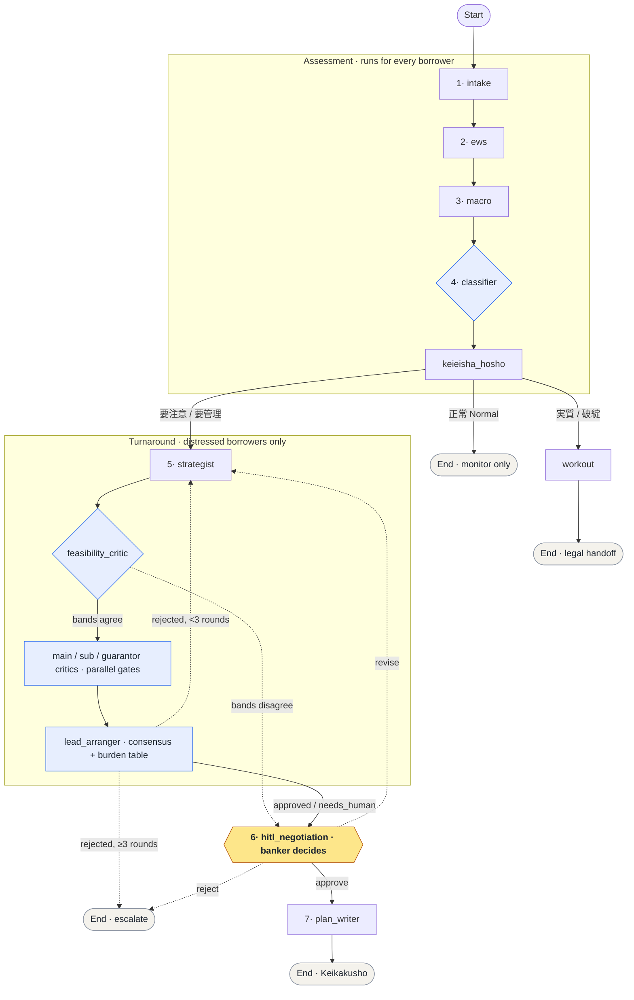

> この文書は [README.md](../../README.md) の日本語訳です。最新の正規版は英語版を参照してください。

<div align="center">

# 再生 (Saisei)


[](../../README.md) [](説明.md)

**日本の地域銀行向け自律型早期警戒・経営改善計画書作成プラットフォーム。**

[](https://github.com/adilouafssou/saisei/actions/workflows/ci.yml)
[](https://www.python.org/downloads/)
[](https://github.com/astral-sh/ruff)
[](https://mypy-lang.org/)
[](https://reflex.dev/)

</div>

Saisei は中小企業借入人の財務健全性を監視し、金融庁枠組みに基づいて信用リスクを分類し、
バンカーとの協働により規制準拠の経営改善計画書（経営改善計画書）を共同作成します。

**LangGraph**（ステートフルなマルチエージェントオーケストレーションと native HITL）、
**Reflex**（Python ネイティブ UI）、および厳格な **Pydantic V2 / mypy --strict** ドメインコアで
構築されています。

---

## 解決すべき課題

金融庁の **金融検査マニュアル** に基づき、地方銀行は各借入人を継続的に査定し、
健全性が悪化した場合は融資を引き揚げるのではなく、**経営改善計画書の策定を支援する**ことが求められます。
今日その作業は手作業で遅いです：

- 与信担当者が月次試算表（試算表）を目視で確認し、売上低下、マージン圧縮、価格転嫁失敗を探す。
- 信用区分（正常 / 要注意 / 要管理）が担当者によって異なる。
- 日銀の金利正常化と T+1/T+2 決済による資金繰りストレスがモデル化されることはほとんどない。
- 経営改善計画書そのものは白紙から書き起こされる。

その結果：**早期警戒信号が遅く捕捉され、中小企業が既に経営難に陥ってから支援が到着する。**

## ローン融資案件ライフサイクル

融資案件（融資案件）は完全なライフサイクルを持ちます：申込 → 審査 →
承認 → 実行 → 正常運営 →、健全性が悪化すると、条件変更または管理回収 → 完済
または償却。Saisei はこれを第一級のイベントソース型ローン実体としてモデル化します
（クローズド `LoanStatus` ステートマシン；現在のステータスはアペンド専用の
イベントログから*派生*し、変異することはありません）。
したがって借入人の履歴は全弧を通じた 1 つの継続的でかつ監査可能なレコードです。

Saisei は意図的に、ライフサイクルの**困窮の後半に深く**焦点を当てています —
早期警戒、分類、ターンアラウンド、管理回収のステップが、中小企業が実際に救済されるか失われるかを決定し、
製品の分析的深さが集中する場所です。ライフサイクル脊椎は、その深さが実際の融資案件に付着することを可能にします：
悪化する金融庁分類は `条件変更` / `管理回収` 遷移にマップされ、
すべてのクレジット権限と困窮認識遷移は human-in-the-loop ゲートの対象です — バンカーが決定します。
融資組成（融資組成）と貸出管理（貸出管理）は同じ脊椎に付着し、
各々はそれ自体の HITL ゲート付きグラフと HTTP サーフェスによって駆動されます。
完全なステートマシン、法的遷移テーブル、および does / never-does 境界については、
[`docs/en/LOAN_LIFECYCLE.md`](../../docs/en/LOAN_LIFECYCLE.md) を参照してください。

## ソリューション

Saisei は与信担当者が行うべき完全なアセスメントを実行し、**戦略をコミットする前にバンカーを待ちます**：

1. **インテーク** — アイデンティティを解決（7 桁 TDB コード → 13 桁法人番号）、信用報告書を取得、反社会的勢力チェックを実施。
2. **EWS スコアリング** — 月次 J-GAAP 試算表のトレンドから 0–100 の Early Warning Signal を生成。
3. **マクロストレス** — 日銀金利カーブと決済流動性を折り込み、資金繰りギャップを推定。
4. **金融庁分類** — シグナルを債務者区分にマップ。正常先はモニタリングのみ；その他はターンアラウンドワークフローに進入。
5. **戦略提案** — グラウンデッド戦略（価格転嫁、原価削減、販管費合理化、資金繰り改善）で、
   企業の*実際の*数値から派生した改善幅。
6. **ヒューマン・イン・ザ・ループ** — グラフが**中断**；バンカーが承認、修正依頼、またはエスカレーション。
7. **計画書作成** — Markdown 形式の決定論的経営改善計画書ドラフト、
   すべての数値を保持しながらプローズを改善するオプション LLM ポーランド付き。

> **設計姿勢：** 数値は決定論的に計算され、真実の源です；LLM は理由付けとプローズのフレーズのみを行い、
> 数値を発明することはありません。また、定性的な主張は未検証のまま事実としてバンカーに到達することはありません：
> すべてのアドバイザリー文は決定論的信号または取得元にグラウンドされるか、
> 見える形で**【未検証 / unverified】**とマークされています — システムが数値に適用する同じ verifier ゲート姿勢を、
> 主張に拡張したもの。システムは LLM 構成なしで完全に**オフラインで**実行・テストされます。

### AI の使用方法（およびなぜそれが役立つか）

Saisei は AI ネイティブですが、AI は意図的に指向されています。
これは与信担当者が行う判断の重い**推論**を実行し、人間の代わりに決定することはありません：

- **マルチエージェントオーケストレーション（LangGraph）。** ステートフルなグラフがアセスメントをシーケンスし、
  複数日の一時停止をまたいで永続化し、native HITL 割り込みを実行。
- **模擬債権者会議。** 独立したクリティックエージェントが各債権者の視点から計画について議論
  （主幹事銀行 / シンジケート / 保証協会）；リードアレンジャーエージェントが議論を、
  バンカーが実際の会議の前に読むブリーフィングに統合。
- **可行性推論 + 意見の相違サーフェッシング。** アドバイザリークリティックが戦略が現実的かどうかを判定し、
  その読みが決定論的フロアと強く不一致の場合、ケースをヒューマンにルーティングして相違を解決。
- **取得増強メモリ。** 関連する先例がアドバイザリー推論に情報を提供
  （二層 pgvector + RediSearch メモリ）。
- **計画書作成。** オプション LLM が numeric-preservation ゲート下で計画のプローズをポーランド。
- **請求グラウンディング（幻覚コントロール）。** すべてのバンカー向けアドバイザリー請求 —
  各クリティックのリハーサル姿勢と可行性メモ — を決定論的検証器を通じて実行：
  請求は決定論的信号または取得元を引用するか、ストリップされるか見える形でマークされていない。
  製品の numeric 姿勢（生成、次に地図を照らし合わせて検証）を散文に拡張。
- **キャプチャされた決定。** バンカーの決定は、時間をかけて推論層を改善できるラベル付きデータとして記録。

境界は厳密かつ構造的です：**AI は理由付けと推奨；決して数値を生成または変更せず、
人間の代わりに決定することはありません。** 理由付けと推奨は決定ではありません —
バンカーは唯一の決定者であり、ワークフローはヒューマンサインオフなしで物理的に進行することはできません。
各 AI コントリビューションの完全な説明と正確な does / never-does 境界については、
[`docs/en/AI_ARCHITECTURE.md`](../../docs/en/AI_ARCHITECTURE.md) を参照してください。

## アーキテクチャ

共有 Pydantic V2 ステート上の単一 LangGraph `StateGraph`。
データ読み込みノードは `MockDataProvider` インターフェースの背後に存在し、
決定論的モックは live Core Banking / TDB / EDINET クライアント
**グラフに触れることなく**交換可能です。

以下のフローは [The solution](#the-solution) の 7 ステップアセスメントと一致するように番号付けされています。
GitHub および GitLab は Mermaid ダイアグラムを自動的にレンダリングします。



**凡例** —実線 = 通常のフロー · 破線 = 修正 / 不一致ループ
· **アンバー** = 唯一の human-in-the-loop 決定 · **青** = 決定論的ルールベースゲート（LLM ではない）
· 数字 1–7 は上記の 7 つのアセスメント ステップにマップ。

`hitl_negotiation` を除くすべてのステップは決定論的ノードです。唯一真のエージェント。
`interrupt()`/`Command(resume=...)` 一時停止を駆動。
`feasibility_critic` はアドバイザリー操作事前スクリーンと**純粋決定論的**和解述語を実行します：
LLM 可行性バンドと決定論的フロアバンドが ≥ 構成された距離だけ不一致する場合、
ケースを直接 `hitl_negotiation` にルーティングして人間が不一致を解決；
そうでない場合は 3 つのクリティックにファンアウト。
3 つのクリティックと `lead_arranger` はルールベースゲート — 判定と数値は LLM によって生成されません。
`keieisha_hosho` はすべての借入人に対して実行；可行性クリティック、3 つのクリティック、および
`lead_arranger` は困窮中（要注意 / 要管理）の借入人に対してのみ実行。

### 主要な設計判断

| 懸念事項 | 決定 | 根拠 |
|---|---|---|
| オーケストレーション | LangGraph `StateGraph` | ファーストクラスステート、条件付きエッジ、HITL 向けネイティブ `interrupt()`/`Command(resume=...)` |
| ステート永続化 | Postgres チェックポインター | HITL 一時停止は数日続く場合があり；ステートは再起動後も保持される必要がある |
| 金額 | カスタム `JPY` int 型 | 円の元本は整数のみ；型は検証時に小数を拒否 |
| ドメインモデル | Pydantic V2、`frozen`、`extra="forbid"` | 不変、クローズド財務レコード；タイポと余分なフィールドは大きく失敗 |
| FSA 区分 | クローズド `StrEnum` | 規制セットは正確に 5 つの値 — 型が 6 番目を不可能にする |
| LLM | オプション、ポーランド専用 | 決定論性と監査可能性が最初；モデルは数値を生成しない |
| データソース | `MockDataProvider` シーム | ライブクライアントは 1 つのインターフェース背後にドロップイン、グラフ変更ゼロ |

### スタック

| レイヤー | テクノロジー |
|---|---|
| フロントエンド | Reflex >= 0.6 |
| バックエンド / API | FastAPI + LangGraph >= 0.2 |
| ステート | PostgreSQL（psycopg v3 チェックポインター） |
| キャッシュ / キュー | Redis |
| エージェントメモリ | pgvector（長期）+ RediSearch（短期） |
| ツーリング | uv、ruff、mypy（strict）、pytest、structlog |

### エージェントメモリ（アドバイザリー取得）

可行性クリティックは、取得された先例（過去の計画、ベンチマーク、FSA パッセージ）で
**アドバイザリー専用**のノートを補強します。想起は、スタックが既に実行している Postgres および
Redis 上の 2 層エージェントメモリとしてモデル化されます — 新しいインフラなし：

- **長期 → pgvector。** 耐久先例コーパス、Postgres に埋め込まれた。網羅的で、再起動後も保持。
  `python -m app.backend.tools.retrieval_ingest` 経由でシード。
- **短期 → RediSearch。** Redis 内の高速で TTL バウンド想起キャッシュ、クエリ時に入力。

ルックアップは短期メモリを最初にヒット、ミスで長期メモリにフォールバック、
その後結果を短期メモリに戻す。各層は独立してオプション（`SAISEI_PGVECTOR_DSN` /
`SAISEI_REDISEARCH_URL`）；どちらも設定されていない場合、取得は決定論的モックを使用し、
システムはオフラインでテスト可能なまま。取得はアドバイザリー専用で、バンド、スコア、ゲート、
またはルートに供給しません。

> 完全なデータおよびメモリアーキテクチャ — キャッシュ-オーバー-ストア関係、
> ライブ決定パスからのオフラインラーニングパスの分離、およびデータガバナンス姿勢を含む —
> については、[`docs/en/DATA_ARCHITECTURE.md`](../../docs/en/DATA_ARCHITECTURE.md)
> （日本語：[`docs/ja/データアーキテクチャ.md`](データアーキテクチャ.md)）を参照してください。

### 意図的なスコープ

- **厳格な型チェックは `backend` と `tests` をカバー、`frontend` はカバーしません。**
  Reflex は UI を動的 `Var` オブジェクトとしてモデル化し `mypy --strict` と相性が悪い；
  厳格チェックはドメインコアの価値がある場所。
- **ストラテジストは透明なヒューリスティックを使用**（例：3% 価格引き上げ、2% COGS カット）
  学習モデルではなく、提案されたすべての数値が説明可能で実績値に基づくままです。
  学習進化については [`NEXT_STEPS.md`](../../docs/en/NEXT_STEPS.md) を参照。
- **分類は「まだ救えます」FSA バンドをモデル化** — システムが機能する
  （[`DOMAIN_ONBOARDING.md`](../../docs/en/DOMAIN_ONBOARDING.md) を参照）；
  本当に破産した借入人（実質破綻先 / 破綻先）は法務 / 清算ハンドオフの `workout` ノードにルーティング。

## クイックスタート

```bash
cp .env.example .env      # LLM キー実行に不要
make setup                # uv インストール、依存関係同期、コンテナビルド、DB シード
make seed-memory          # （オプション）pgvector 長期メモリシード
make run-dev              # web + api + postgres + redis
make verify               # ruff + mypy --strict + pytest（CI ゲート）
```

主要フィクスチャはコスト増加と失敗した価格転嫁に見舞われた悪化中の愛知県金属部品メーカー
（愛知精密製作所株式会社）で、要管理（Doubtful）分類と資金繰り赤字を駆動 —
ワークフローが存在する正確なケース。

> **再現可能なビルド：** `make setup` は `uv lock` を実行；生成された `uv.lock` を 1 回コミットすると、
> CI と Docker イメージはバイト単位で同一の依存セットを解決。

## 継続的インテグレーション

[GitHub Actions](.github/workflows/ci.yml) は `make verify` と同じゲートを実行 —
**ruff**（lint + format）、**mypy --strict**、**pytest**、および merge ブロッキング regulated-output **eval**
ゲート — `main` へのすべてのプッシュとすべてのプルリクエストで。
ジョブは `uv` で依存関係をインストール、完全オフラインで実行（アプリは決定論的モックプロバイダーにフォールバック）。
そのため CI はデータベース、Redis、API キーを必要としません。
完全なパイプラインリファレンス — ゲート別の目的、規制上の根拠、および各チェックをローカルで再現する方法については、
[`docs/en/CONTINUOUS_INTEGRATION.md`](../../docs/en/CONTINUOUS_INTEGRATION.md) を参照してください。

## リポジトリマップ

```
app/
  app.py                      rx.App() + FastAPI factory (create_app): /health /ready,
                              run/resume API、監査検査官およびアドミンルート
  backend/
    state.py                  SaiseiState (Pydantic V2) + リデューサー + サブモデル
    graph.py                  StateGraph 配線、ルーター、Postgres/Memory チェックポインター
    auth.py                   OIDC bearer-token 検証トランスポート（JWKS、非対称のみ）
    identity.py               検証済み請求 -> Identity マッピング + 本番ガード
    secrets.py                secret-provider シーム（@env:/@file:/@/path；Vault ドロップイン）
    llm.py                    単一 LLM 構成 + auth チョークポイント（secret シーム経由）
    observability.py          LangSmith トレーシング + HITL 決定キャプチャ（オフラインなし-op デフォルト）
    api/                      グラフをサービスとして駆動するための HTTP サーフェス
      runs.py                   冪等 POST/GET/resume ラン エンドポイント（同期 + 非同期）
      execution.py             off-request-path ラン レジストリ + スレッドプール実行者シーム
    agents/                   turnaround_orchestrator（HITL interrupt/resume）+ saisei_chat
    nodes/                    決定論的ワークフロー ステップ
      financial_extraction.py   intake（TDB ID、反社会的勢力）+ macro（資金繰りギャップ）
      ews_scoring.py            EWS 計算（0-100）+ FSA 分類
      kaizen_generation.py      strategist + 計画書レンダリング + オプション LLM ポーランド
      keieisha_hosho.py         保証解放 + 後継者アセスメント
      lead_arranger.py          コンセンサスエンジン（Torimatome fan-in）
      workout.py                実質破綻先 / 破綻先への法務/清算ハンドオフ
      critics/                  可行性（アドバイザリー事前スクリーン + 和解）+
                                3 つの並列クリティック ノード（主幹事銀行 / 協調銀行 / 保証協会）
    analysis/                 純粋なオフラインアドバイザリー分析 + claim-grounding ゲート
      claim_grounding.py        決定論的請求引用検証器（幻覚コントロール）
      threshold_calibration.py  evidence-based RECONCILIATION_BAND_DISTANCE 推奨
      calibrate_cli.py          キャプチャ された結果コーパス上の `make calibrate`
    audit/                    アペンドのみ、ハッシュチェーン + Ed25519 署名監査ログ
                              （シンク、レコード、管理：保持 / 編集 / リーガルホールド）
    portfolio/                オプトイン ブック ウォッチリスト ストア + read-side 監視プランナー
    trajectory/               オプトイン エージェント軌跡ストア + PII セーフ in-VPC エクスポート境界
    export/                   経営改善計画書 DOCX/PDF/XLSX レンダー + モデルカード / 公平性レポート
    tools/                    MockDataProvider + fixtures/（バンドル JSON）
      retrieval.py              二層エージェント メモリ：pgvector（長期）+ RediSearch（短期）
      retrieval_ingest.py       先例コーパスを pgvector 長期メモリにシード
    prompts/                  extraction_rules.md、kaizen_templates.md
  frontend/                   Reflex UI（ステート、コンポーネント、ページ）
  shared/
    constants.py              すべてのしきい値の単一情報源
    settings.py               pydantic-settings（env prefix SAISEI_）
    platform.py               ランタイムプラットフォーム検出 + チェックポインター自動選択
    models/                   会計（TrialBalance）、money（JPY）、分類（FsaClass）
migrations/                   Alembic スキーマ マイグレーション（`make migrate`；upgrade head）
scripts/                      init_pgvector.sql + setup_env.sh（dev ブートストラップ）
assets/                       Reflex 用静的アセット（画像、フォント、CSS オーバーライド）
tests/                        pytest — ドメイン、ノード、グラフフロー、API、監査、end-to-end
alembic.ini                   Alembic 構成（app スキーマ；チェックポインター テーブルは PostgresSaver が所有）
```

## さらに読むべき

- [`PRODUCT_MANIFEST.md`](../../docs/en/PRODUCT_MANIFEST.md) — ロール別マニュアル：あなたのロールが何であれ始めてください。
- [`AI_ARCHITECTURE.md`](../../docs/en/AI_ARCHITECTURE.md) — AI の実際の使用方法：負荷を支える推論、および正確な does / never-does 境界。
- [`DEMO_TUTORIAL.md`](../../docs/en/DEMO_TUTORIAL.md) — 10 分間の jargon-light ウォークスルー（完全なエージェント型ワークフローは外部 LLM キーなしで実行）。
- [`BUSINESS_OVERVIEW.md`](../../docs/en/BUSINESS_OVERVIEW.md) — パートナーと決定者向けの非技術的市場、価値、および moat ビュー。
- [`ROADMAP.md`](../../docs/en/ROADMAP.md) — 元々のアーキテクチャ仕様。
- [`NEXT_STEPS.md`](../../docs/en/NEXT_STEPS.md) — プロトタイプから本番環境への道筋。
- [`CONTINUOUS_INTEGRATION.md`](../../docs/en/CONTINUOUS_INTEGRATION.md) — CI パイプライン リファレンス。
- [`AGENTIC_ONBOARDING.md`](../../docs/en/AGENTIC_ONBOARDING.md) — このコードベースを通じて教えるエージェント AI カリキュラム。
- [`DOMAIN_ONBOARDING.md`](../../docs/en/DOMAIN_ONBOARDING.md) — 非専門家向けの日本金融ドメイン。
- [`claude.md`](../../claude.md) — エンジニアリング規則とガードレール。

## 日本語ドキュメント（Japanese documentation）

すべての主要ドキュメントの日本語翻訳は `docs/ja/` にあります。

| 日本語訳 | 英語ソース |
|---|---|
| [docs/ja/説明.md](説明.md) | [README.md](../../README.md) |
| [docs/ja/引き継ぎ.md](引き継ぎ.md) | （日本語のみ / Japanese only） |
| [docs/ja/ロードマップ.md](ロードマップ.md) | [docs/en/ROADMAP.md](../../docs/en/ROADMAP.md) |
| [docs/ja/今後のステップ.md](今後のステップ.md) | [docs/en/NEXT_STEPS.md](../../docs/en/NEXT_STEPS.md) |
| [docs/ja/エージェント入門.md](エージェント入門.md) | [docs/en/AGENTIC_ONBOARDING.md](../../docs/en/AGENTIC_ONBOARDING.md) |
| [docs/ja/ドメイン入門.md](ドメイン入門.md) | [docs/en/DOMAIN_ONBOARDING.md](../../docs/en/DOMAIN_ONBOARDING.md) |
| [docs/ja/AIアーキテクチャ.md](AIアーキテクチャ.md) | [docs/en/AI_ARCHITECTURE.md](../../docs/en/AI_ARCHITECTURE.md) |
| [docs/ja/デモチュートリアル.md](デモチュートリアル.md) | [docs/en/DEMO_TUTORIAL.md](../../docs/en/DEMO_TUTORIAL.md) |
| [docs/ja/エンジニアリング規約.md](エンジニアリング規約.md) | [claude.md](../../claude.md) |
